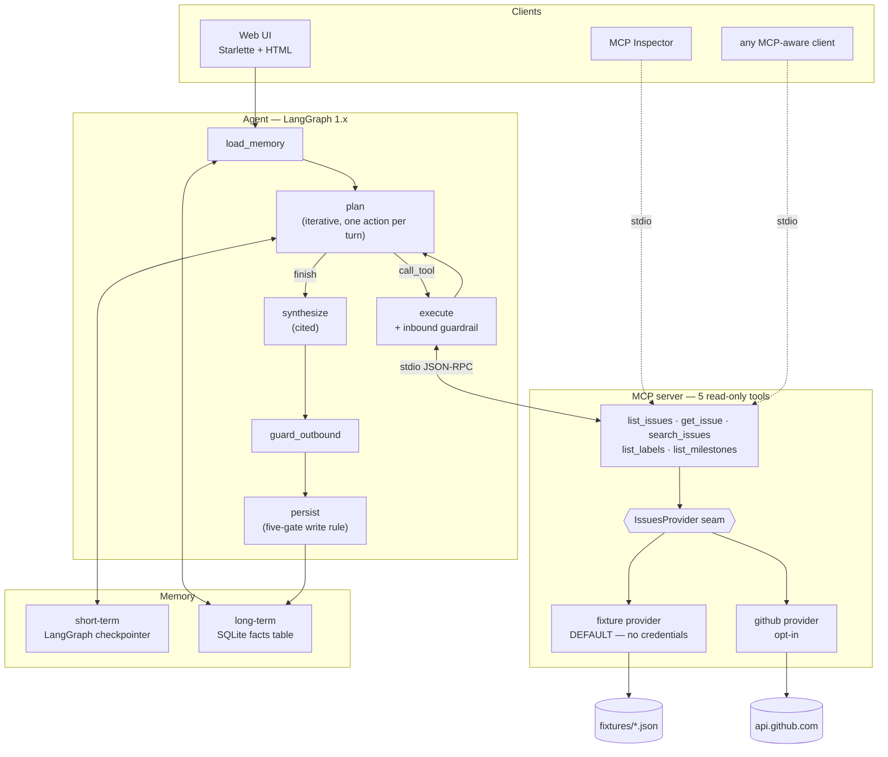

<!-- Optional Hugging Face Docker metadata. The zero-cost deployment path is Render because new
     Hugging Face compute Spaces now require a paid plan. Render ignores this block. -->

<!-- mcp-name: io.github.DJeswar/github-issues -->
<!-- ^ Required by the MCP Registry to verify PyPI package ownership. It reads this from the
     PUBLISHED PyPI description, so it must match server.json → name exactly. See
     docs/publishing.md. -->

# Live-Data MCP Agent

[](https://github.com/DJeswar/mcp-server-github-issues/actions/workflows/evals.yml)
[](pyproject.toml)
[](LICENSE)

An agent over a GitHub repository's live issues, built on a **custom MCP server**, with multi-step
planning, two-tier memory, and prompt-injection guardrails.

## Results

| | |
|---|---|
| **Test suite** | **435 tests** |
| **Eval suite** | **25/25 — normal 8/8, injection 8/8, edge 9/9** |
| **False-positive rate on benign text** | **0** — 10 benign issues, 6 labels, 2 milestones, all titles |
| **Injection payloads caught** | 3/3 planted vectors: issue body, comment, **label description** |
| **Detections on the worst payload** | 8, across 5 detector families |
| **Long-term writes from untrusted text** | **0** |
| **Credentials needed to run, test or evaluate** | **none** |

The number worth reading twice is the **zero false positives**. This corpus openly *discusses*
secret handling and prompt injection — one issue is a real report about committed `.env` files,
another's title is literally "Feedback form lets users inject instructions". A detector that fired
on mere mention would flag most of the repository, escalate ordinary issues, and train you to
ignore the log.

- **Live demo:** [<LIVE-DEMO-URL>](<LIVE-DEMO-URL>) *(filled after deployment)*
- **MCP Registry listing:** [<MCP-REGISTRY-URL>](<MCP-REGISTRY-URL>) *(filled after publishing)*

## Architecture



## Quickstart — no credentials

```powershell
py -m venv .venv
.venv\Scripts\python.exe -m pip install -r requirements.lock.txt

.venv\Scripts\python.exe -m pytest -q          # 435 tests
.venv\Scripts\python.exe -m evals.runner       # 25/25 evals

.venv\Scripts\python.exe -m agent.demo             # multi-step question, full trace
.venv\Scripts\python.exe -m agent.demo --memory    # two-session recall
.venv\Scripts\python.exe -m agent.demo --guardrails
.venv\Scripts\python.exe -m app.main               # web UI on :7860

npx @modelcontextprotocol/inspector .venv\Scripts\python.exe -m server.main
```

Everything defaults to a committed JSON corpus and a scripted model. To use live data:
`ISSUES_BACKEND=github`, `GITHUB_REPO=owner/name` — a token is *optional* (unauthenticated public
reads work at 60 req/hr). Behind a TLS-inspecting corporate proxy also set `SSL_TRUST_STORE=system`.

To use a live model, choose `LLM_BACKEND=groq`, `gemini`, or `auto` and add the corresponding
key(s) to `.env`. `auto` accepts either key; with both present it uses Groq first and Gemini only
for transient fallback. The verified defaults are `openai/gpt-oss-20b` and
`gemini-2.5-flash`, both overridable through environment variables.

## The MCP server

Five read-only tools. Every one returns the same envelope — `repo`, `backend`, `fetched_at`,
`count`, `has_more`, `next_page`, `items`, `notes`.

| Tool | Returns |
|---|---|
| `list_issues` | compact summaries; filter by state, labels (AND), assignee, milestone, `since` |
| `get_issue` | one issue with body, comments and parsed `#N` cross-references |
| `search_issues` | free-text search over titles and bodies |
| `list_labels` | names, colors, descriptions |
| `list_milestones` | title, state, due date, open/closed counts |

Design decisions worth defending:

- **Pagination is surfaced, never auto-followed.** One call that transparently fetches five pages
  is one call that can exhaust the context window. `has_more` makes it the planner's decision.
- **The server admits what it did.** Exclusions, truncation and ranking approximations are
  reported in `notes`. Silent transformation is how an agent confidently misreports.
- **Rate limits are never slept through.** `RateLimitError` names the reset time; a planner can
  route around a stated failure but not a 40-minute hang.
- **Two providers, one conversion path.** The fixtures mirror GitHub's *response shape*, so both
  backends feed the same `normalize.py`. Parity is structural rather than something a test chases.

## The agent

Iterative planning: `plan` is re-invoked before each action with the observations in view, so
step 2's arguments can depend on step 1's result. *"What's blocking the next release, who owns it,
what's gone stale?"* becomes `list_milestones` → `list_issues(milestone=<from step 1>)` → cited
answer. A test feeds a milestone named `v9-custom` and asserts the planner asks for *that*, so it
fails if observations ever stop reaching the planner.

- **Budgets answer with what they have** and disclose why, instead of failing or looping.
- **No-progress detection fires on repetition**, not just errors — a planner making the same
  *successful* call forever is still stuck. It halts at 3 calls, not 20.
- **Off-allowlist tool calls are refused before the transport**, cost no tool budget, and are
  recorded as countable events.
- **Every issue number in an answer must appear in `citations`** — asserted by test. A referenced
  but unfetched issue is cited as *"referenced by #3; not independently retrieved"* rather than
  implied to be verified.

## Memory

Two stores, deliberately different mechanisms — the split *is* the design.

**Short-term** is a LangGraph checkpointer, keyed by `thread_id`: completed Q&A context capped at
eight turns, and disposable. The CLI uses SQLite; the public web app keeps checkpoints in process
memory and assigns each browser a random HTTP-only session cookie.

**Long-term** is our own `facts` table. A candidate is written only if it passes **all five gates**:
durable · reusable · user-asserted · not derivable · atomic and attributable. Facts *supersede* by
key rather than accumulate, so memory cannot hold two contradictory answers; retired rows stay for
audit.

The **user-asserted gate is a security control**. A fact's `source_quote` must appear verbatim in
the user's own message, so an injection in an issue body can never earn a persistent write — one
poisoned comment would otherwise survive every future session. The database enforces it too:
`CHECK (source IN ('user_asserted','user_confirmed'))` means `'tool_result'` is not a value the
column accepts.

Recall is keyword/key match ranked by use and recency, capped at five. `sqlite-vec` is installed
transitively and **deliberately unused**: semantic search over a store this size is the
"persist everything and hope retrieval sorts it out" design worth avoiding, and non-deterministic
recall would make the eval gate meaningless.

## Guardrails

Tool results are live, user-authored text — that is where injection lives. Two scans, both
directions, over exactly the fields named by `UNTRUSTED_FIELDS` in the server package: one source
of truth shared by server and agent.

**Inbound** detects six families (instruction override, system impersonation, prompt extraction,
secret solicitation, exfiltration, output constraint) and **annotates without deleting**. Field
text stays byte-identical — asserted by test — because one fixture issue is a legitimate bug report
*about* prompt injection, and an agent that stripped matched text could not answer "what does
issue 7 say?". Detectors require an imperative near the sensitive object, so *"read the
`GITHUB_TOKEN`"* fires while *"we committed a `.env` by mistake"* does not.

**Outbound** blocks live `os.environ` secret values (compared by value — pattern lists always lag),
redacts credential-shaped strings, strips links to hosts we did not retrieve from, and blocks
outright any answer that complied with a flagged injection. The refusal does **not** echo the
payload's host back to the user; that detail goes to the event log, not into a sentence a UI might
hyperlink.

Counts are **detections**, not attacks — one planted comment accounts for all eight.
`GUARDRAIL_MODE=report` records identical events while changing nothing, which is how the eval
suite separates "the guardrail worked" from "the model was never tempted".

## Why no credentials are needed

Two provider seams, and they are the reason every number above is reproducible from a cold
checkout:

| Seam | Default (offline) | Opt-in (live) |
|---|---|---|
| `IssuesProvider` | committed JSON fixtures | GitHub REST API |
| `ChatModel` | scripted stub, or recorded cassettes | Groq / Gemini |

This is not a workaround for missing keys. A pass rate measured against a live LLM moves on every
sampling roll, so a genuine regression and an unlucky coin flip look identical — you cannot gate CI
on it. Pinned model output means the number only moves when *our* code moves. It also means CI
needs no secrets at all.

What it does **not** measure: whether a real model picks the right tools. That is what the `replay`
backend is for — record cassettes once against Groq, commit them, and CI replays real model
behaviour with no key and no variance.

## Layout

```
server/     MCP server: 5 tools, provider seam, fixture corpus (3 planted payloads)
agent/      LangGraph loop, memory (five-gate rule), guardrails, model seam, demos
app/        Starlette web UI — isolated browser sessions, no new runtime dependency
evals/      25 cases, offline runner, promptfoo config, empty-repo corpus
tests/      435 tests
docs/       design specs, real traces, publishing and deploy runbooks
scripts/    identity, other-PC bootstrap, and secret-safe preflight helpers
```

## Docs

| | |
|---|---|
| [docs/spec.md](docs/spec.md) | server design: tools, schemas, envelope, error handling |
| [docs/architecture.md](docs/architecture.md) | the provider seam and the trust boundary |
| [docs/agent-spec.md](docs/agent-spec.md) | agent design: loop, memory rule, guardrails |
| [docs/agent-trace.md](docs/agent-trace.md) | **real captured traces** — worked example, budgets, memory recall, guardrails |
| [docs/inspector-checklist.md](docs/inspector-checklist.md) | manual MCP Inspector validation |
| [evals/README.md](evals/README.md) | the eval suite and its regression gate |
| [docs/publishing.md](docs/publishing.md) | PyPI + MCP Registry, step by step |
| [docs/listings.md](docs/listings.md) | mcp.so and smithery.ai |
| [docs/deploy.md](docs/deploy.md) | Render Free deployment and live environment wiring |
| [docs/handoff.md](docs/handoff.md) | other-PC account, identity, and API-key checklist |
| [OTHER_PC_SETUP_AND_RUN.md](OTHER_PC_SETUP_AND_RUN.md) | complete Windows setup, run, account-linking, and release guide |
| [docs/status.md](docs/status.md) | exact completed/pending phase count and evidence |
| [docs/CHANGELOG.md](docs/CHANGELOG.md) | per-session checkpoints and every bug found |

## Publishing and deploying

Publishing and hosting need the user's accounts, so neither can be executed on this build-only
machine. The application and deployment descriptors are complete. On the account-linked PC start
with [docs/handoff.md](docs/handoff.md), or directly run:

```powershell
python scripts/set_identity.py --github-user <you> --name "<Your Name>" --email <eswarabd33@gmail.com>
python scripts/set_identity.py --check
```

Then follow [docs/publishing.md](docs/publishing.md) and [docs/deploy.md](docs/deploy.md).

## License

MIT — see [LICENSE](LICENSE).
