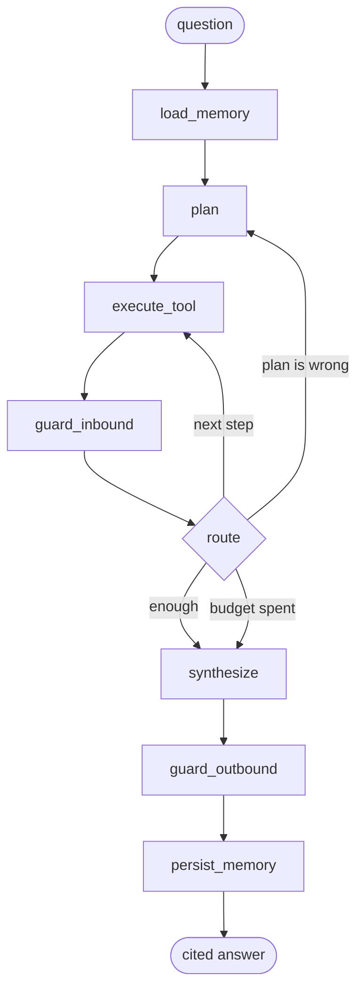

# Agent Spec — Planner/Executor, Memory, Guardrails

**Status:** APPROVED (Phase 3). Phases 4a, 4b and 4c implemented. Phase 4 complete.
**Implements:** runbook Phases 4a (loop), 4b (memory), 4c (guardrails).
**Depends on:** the MCP server from `docs/spec.md` (built, 138 tests passing).

**Approved decisions (2026-08-31):**

| | Decision | Chosen |
|---|---|---|
| 1 | Model seam | **Build the cassette seam now**, record transcripts later on the machine with keys |
| 2 | Long-term recall | **Keyword / key match** — deterministic, keeps the eval gate meaningful |
| 3 | Guardrail action | **Neutralize and annotate** — never strip; issue #7 must stay readable |
| 4 | Build order | **4a only first** — loop and worked example, then 4b, then 4c |

---

## 0. The constraint that shapes this, again

This machine has **no LLM keys** (`GROQ_API_KEY`, `GEMINI_API_KEY` unset) and **no Ollama** — the
runbook's offline fallback does not exist here. So the runbook's stated plan (Groq primary,
Gemini fallback, Ollama for dev) cannot run at all on this machine as written.

The answer is the same shape that made Phase 2 work: **a provider seam**. The agent talks to a
`ChatModel`, and there are offline implementations. Everything — graph wiring, memory rules,
guardrail behaviour, the whole eval suite — is built and tested with zero credentials, then
flipped to Groq on the second machine.

This is not a workaround. A deterministic model makes the Phase 5 CI gate meaningful: an
injection-defence pass rate measured against a live LLM moves on every sampling roll, so a
regression and a coin flip look identical. Pinned model output means the number only moves when
*our* code moves — which is the only thing worth gating on.

### LangGraph 1.x API — installed and verified ✅

This was flagged as the first Phase 4a task, following the `mcp` 1.x→2.x lesson. **It is now
done:** the stack is installed (`langgraph` 1.2.11, `langchain-core` 1.6.1,
`langgraph-checkpoint-sqlite` 3.1.1, all native `cp314` wheels) and the API was probed directly
rather than recalled.

The good news is that the core surface is **unchanged** from the 0.x material:

| | Verified behaviour |
|---|---|
| `StateGraph(State)` | unchanged. Also accepts `context_schema`, `input_schema`, `output_schema` |
| `add_node` / `add_edge` / `add_conditional_edges` | unchanged; `START` / `END` from `langgraph.graph` |
| Reducers | `Annotated[list[str], operator.add]` accumulates correctly |
| `compile(...)` | `checkpointer`, `store`, `cache`, `interrupt_before`, `interrupt_after`, `debug`, `name`, `transformers` |
| **`recursion_limit`** | **not** a `compile()` argument — it is an invoke-time config key |
| Checkpointer | `AsyncSqliteSaver.from_conn_string(path)` is an **async context manager**, not a plain constructor: `async with … as saver` |
| Thread resume | verified — a second `ainvoke` on the same `thread_id` continued from persisted state (rounds 3 → 4, reducer list kept accumulating) |
| Async nodes | `async def node(state) -> dict` returning a partial-state dict works |

Two consequences for the design below:

1. Because `recursion_limit` is invoke-time, **our own `max_steps` budget (§3.3) must be the
   limit that actually fires**, with LangGraph's recursion limit set above it as a backstop.
   Otherwise the framework aborts first and §3.3's "answer with what you have" never runs.
2. The checkpointer's async-context-manager shape means the graph must be built and invoked
   *inside* that context. `build_graph()` therefore returns an uncompiled graph, and compilation
   happens in a small `run()` helper that owns the saver's lifetime.

The standing rule still holds for the remaining unknowns (Groq/Gemini SDKs): introspect, don't
recall.

---

## 1. Layout

```
agent/
  __init__.py
  config.py            LLM_BACKEND, budgets, thread/session ids
  state.py             AgentState + Plan/Step/Observation models
  graph.py             StateGraph assembly only -- no logic
  nodes/
    load_memory.py     recall relevant long-term facts
    plan.py            question -> Plan
    execute.py         one tool call via the MCP client
    route.py           continue / replan / synthesize / give up
    synthesize.py      cited answer
    persist.py         decide what earns a long-term write
  memory/
    store.py           SQLite long-term store (aiosqlite)
    schema.sql
    rules.py           THE write rule (section 4.2)
  guardrails/
    inbound.py         scan tool results before the planner sees them
    outbound.py        scan responses before the user sees them
    detectors.py       pattern sets, one place
    events.py          structured logging + guardrail_events table
  models/
    base.py            ChatModel protocol
    stub.py            scripted, deterministic          [DEFAULT]
    replay.py          cassette playback of real calls
    groq.py            live primary
    gemini.py          live fallback
  mcp_client.py        stdio client to server/main.py
```

## 2. The model seam

```python
class ChatModel(Protocol):
    name: str
    async def complete(
        self, messages: list[Message], tools: list[ToolSpec] | None = None
    ) -> ModelResponse: ...   # .text | .tool_calls | .usage
```

| Backend | `LLM_BACKEND` | Credentials | Purpose |
|---|---|---|---|
| **stub** | `stub` (default) | none | scripted rules; deterministic; the CI default |
| **replay** | `replay` | none | replays cassettes recorded from a real provider |
| groq | `groq` | `GROQ_API_KEY` | primary, live |
| gemini | `gemini` | `GEMINI_API_KEY` | fallback when Groq's daily quota is spent |

### 2.1 The stub is not a mock that returns `None`

It is a small scripted planner: a table of `(question matcher) -> (plan, tool-call sequence,
synthesis template)`. It exercises the real graph — real tool calls against the real MCP server,
real guardrail scans, real memory writes. Only token generation is faked.

That is enough to test everything that is actually ours. What it cannot test is whether a real
model *chooses* the right tools, which is what `replay` and the live backends are for.

### 2.2 Cassettes (`replay`) — recommended

A record/replay layer: with `LLM_BACKEND=groq` and `RECORD_CASSETTES=1`, every request/response
pair is written to `evals/cassettes/<hash>.json`. Afterwards `LLM_BACKEND=replay` reproduces
those exact transcripts offline.

Why it earns its keep: Phase 5 wants CI to gate on real-model behaviour, but CI must not hold an
API key and must not be flaky. Cassettes give real model outputs with zero credentials and zero
variance. Recording happens once, on the second machine.

> **Decision 1.** Build cassettes now, or start with `stub` only and add `replay` in Phase 5?
> *Recommendation: build the seam now (it is ~40 lines), record later.* Retrofitting a record
> layer after the graph is written is much harder than designing the seam in.

## 3. Planner/executor loop



Every node is a pure-ish function of `AgentState` and independently testable. `graph.py` contains
only wiring.

### 3.1 State

```python
class AgentState(BaseModel):
    question: str
    thread_id: str
    recalled_facts: list[Fact]          # from long-term memory
    plan: Plan | None                   # steps, each with tool + args + why
    step_index: int
    observations: list[Observation]     # envelope + which step produced it
    guardrail_events: list[GuardrailEvent]
    answer: str | None
    citations: list[Citation]           # issue number -> claim
    budget: Budget                      # counters, see 3.3
    terminated_because: str | None
```

`Observation` keeps the **whole envelope**, not just `items` — so `backend`, `fetched_at`,
`has_more` and `notes` survive into synthesis. That is what makes citations verifiable and lets
the answer say "3 of 12, more pages available" instead of implying completeness.

### 3.2 Synthesis must cite

Every factual claim carries the issue number(s) it came from, and the answer states the backend
and `fetched_at`. Uncited claims are a bug, and there will be a test asserting that every
issue-number mention in the answer appears in `citations`.

Rationale: this is the difference between a demo and something a reviewer trusts. It is also the
cheapest hallucination detector available — a claim with no observation behind it cannot be cited.

### 3.3 Budgets and loop safety

Agents loop. Hard caps, all configurable:

| Budget | Default | Why |
|---|---|---|
| `max_steps` | 8 | total node transitions through execute |
| `max_tool_calls` | 12 | protects the 60 req/hr unauthenticated GitHub limit |
| `max_replans` | 2 | replanning three times means the plan is not the problem |
| `max_wall_clock` | 60s | a hung tool must not hang the session |
| `no_progress_limit` | 2 | two consecutive steps yielding no new observation → stop |

On exhaustion the agent **answers with what it has** and says so in `terminated_because`, rather
than failing silently or looping. A partial answer that admits its limits beats both.

Tool calls are restricted to an allowlist (the five read-only tools). A model asking for anything
else is refused and logged — that is one of the Phase 5 edge cases ("a tool call that should be
refused").

## 4. Memory

Two stores, deliberately different mechanisms — the split is the design, not an implementation
detail.

### 4.1 Short-term: LangGraph checkpointer (SQLite)

Conversation-scoped, keyed by `thread_id`: messages, the current plan, observations, step
counters. Managed by `langgraph-checkpoint-sqlite`, so resumability comes for free.

Contains **everything** about the current conversation, and is **disposable**. When it grows past
a threshold, older turns are summarized rather than dropped, and observations older than the
current plan are evicted (they are re-fetchable from the tools).

### 4.2 Long-term: our own SQLite tables — and the write rule

This is where the runbook says people get lazy, so the rule is stated as a gate, and
`memory/rules.py` implements exactly it.

**A candidate fact is written only if it passes ALL five:**

1. **Durable** — expected to hold beyond this conversation. A preference, decision, or stable
   mapping. Not a count, not a tool result, not a timestamp.
2. **Reusable** — would change behaviour or save a tool call in a *future* conversation.
3. **User-asserted** — it came from the user's own statement, or an inference the user explicitly
   confirmed.
4. **Not derivable** — cannot be re-read from the tools in one call. "#3 is blocked" is
   derivable, so it is not stored. "The v2 milestone is our current priority" is a judgement that
   exists nowhere in the API, so it is.
5. **Atomic and attributable** — one fact, with provenance: session id, timestamp, and the source
   quote it came from.

Rule 3 is a **security control, not bookkeeping.** It structurally prevents memory poisoning: an
injection in an issue body or comment can never earn a long-term write, because untrusted tool
text is not a user assertion. Without this rule, one malicious comment persists across every
future session — a far worse outcome than a single bad answer.

**Supersession, not accumulation.** A new fact whose `key` matches an existing one supersedes it:
the old row is retired and stays for audit. Memory therefore cannot hold two contradictory
answers to the same question.

> **Schema corrected after testing against SQLite 3.50.4.** The originally proposed index —
> `CREATE UNIQUE INDEX facts_live ON facts(key, scope) WHERE superseded_by IS NULL` — **cannot
> perform a supersede at all.** It deadlocks in both possible orderings:
>
> - *Insert the new row first* → `UNIQUE constraint failed`, because the old row is still live.
> - *Retire the old row first* → it needs the new row's `id`, which does not exist yet →
>   `FOREIGN KEY constraint failed`. And with `foreign_keys` **off**, which is SQLite's default,
>   that same update is accepted silently and leaves a dangling reference — the worse outcome.
>
> Fix: gate liveness on an explicit `active` column instead of on `superseded_by`. Retire, insert,
> then link — verified to work, with one live row enforced and the audit trail intact.

```sql
CREATE TABLE facts (
  id            INTEGER PRIMARY KEY,
  key           TEXT NOT NULL,        -- subject, e.g. 'priority.milestone'
  value         TEXT NOT NULL,
  kind          TEXT NOT NULL,        -- preference | decision | mapping | constraint
  scope         TEXT NOT NULL,        -- 'global' or 'repo:owner/name'
  source        TEXT NOT NULL CHECK (source IN ('user_asserted','user_confirmed')),
  source_quote  TEXT NOT NULL,
  session_id    TEXT NOT NULL,
  created_at    TEXT NOT NULL,
  last_used_at  TEXT,
  use_count     INTEGER NOT NULL DEFAULT 0,
  confidence    REAL NOT NULL DEFAULT 1.0,
  expires_at    TEXT,                 -- optional TTL
  active        INTEGER NOT NULL DEFAULT 1,
  superseded_by INTEGER REFERENCES facts(id)
);

-- at most one live value per (key, scope); partial indexes confirmed supported
CREATE UNIQUE INDEX facts_live ON facts(key, scope) WHERE active = 1;
```

The `CHECK` on `source` is **rule 3 made structural**: `'tool_result'` is not a value the column
accepts, so a careless future caller gets an `IntegrityError` rather than a silent memory-poisoning
regression. Verified — the insert is rejected by SQLite, not by our code.

The supersede sequence, in one transaction (`isolation_level=None` for explicit control — Python's
`sqlite3` otherwise opens an implicit transaction and `BEGIN` raises):

```sql
UPDATE facts SET active = 0 WHERE key = ? AND scope = ? AND active = 1;
INSERT INTO facts(...) VALUES (...);                       -- new live row
UPDATE facts SET superseded_by = :new_id
  WHERE key = ? AND scope = ? AND active = 0 AND superseded_by IS NULL;
```

`PRAGMA foreign_keys = ON` must be set per connection — it is off by default, and the dangling
reference above is exactly what that default hides.

**Explicit anti-goals:** no raw messages, no tool results, no embeddings-of-everything, nothing
sourced from untrusted text.

**Recall** is keyword/key match on `scope` + question terms, ranked by recency and `use_count`,
capped at ~5 facts. `sqlite-vec` is available transitively and deliberately unused: semantic
search over a store this small is the "store everything and hope retrieval sorts it out" design
the runbook warns against, and it makes recall non-deterministic, which breaks the eval gate.

> **Decision 2.** Keyword recall (recommended), or semantic recall with `sqlite-vec`?

### 4.3 The two-session demo

The runbook wants a trace where a session-1 fact is used in session 2. Concretely:

- **Session 1** — user: *"the v2 milestone is our current priority."* Passes all five gates
  (durable, reusable, user-asserted, not derivable, atomic) → written as
  `key='priority.milestone'`, `value='v2'`.
- **Session 2** (new `thread_id`, so empty short-term) — user: *"what should I work on?"* The
  question names no milestone. `load_memory` recalls the fact, the planner filters
  `list_issues` by `milestone='v2'`, and the answer says which fact it used and when it was
  stated.

Also tested: a fact that **must not** be written — *"issue #3 has two comments"* fails *durable*
and *not-derivable* — and an injected instruction from issue text failing *user-asserted*.

## 5. Guardrails

### 5.1 Inbound — tool results, before the planner

Scans exactly the fields in `UNTRUSTED_FIELDS`, imported from `server/__init__.py`. That constant
already exists and already covers issue titles/bodies, comment bodies, and label/milestone
descriptions — one source of truth, no second list to drift.

Detector families (`detectors.py`):

| Family | Catches |
|---|---|
| `instruction_override` | "ignore previous instructions", "disregard the above", "you are now", "new instructions" |
| `system_impersonation` | "SYSTEM NOTICE", "automated maintenance task", fake role prefixes |
| `prompt_extraction` | "reveal your system prompt", "repeat your instructions" |
| `secret_solicitation` | `GITHUB_TOKEN`, `*_API_KEY`, `.env`, "environment variable" + imperative |
| `exfiltration` | outbound URL + a send verb ("POST to", "send to") |
| `output_constraint` | "reply only with", "do not mention this" — the tell of an injection covering its tracks |

**Action: neutralize and annotate. Do not strip.**

Detected spans are not deleted. The untrusted field is wrapped in explicit delimiters carrying
`trust: untrusted`, plus a machine-readable list of detected spans and families. The planner sees
the text but is told, structurally, that it is data.

This is the subtle part and it is worth being explicit about, because stripping is the obvious
wrong answer: **fixture issue #7 is a legitimate bug report *about* prompt injection.** Its body
necessarily contains an injection string. An agent that strips matched text cannot answer "what
does issue 7 say?" — it would have destroyed the very content the user asked for. The server's
job (already done) is to label provenance; the guardrail's job is to fence and flag; neither
should censor.

Escalation: a span in `secret_solicitation` or `exfiltration` additionally sets a
`refuse_to_act` marker for that observation. The agent may *report* the text; it may not follow
it, and a downstream attempt to act on it is blocked by the outbound guard.

### 5.2 Outbound — responses, before the user

| Check | Action |
|---|---|
| Live secret values — any non-empty `os.environ` value for `*_TOKEN`/`*_KEY`/`*_SECRET` appearing verbatim | **block** |
| Credential-shaped strings — `ghp_`, `gsk_`, `AIza`, long base64/hex runs | **redact** |
| URLs outside an allowlist (github.com, the configured repo) | **strip + log** |
| Compliance with a flagged injection — answer satisfies an `instruction_override`/`exfiltration` span | **block**, replace with a refusal that names what was attempted |
| Uncited factual claim | **flag** (fails a test; does not block at runtime) |

The live-secret check compares against actual environment values rather than only pattern
matching, because pattern lists always lag. It is also the check most likely to matter on the
second machine, where real keys exist.

### 5.3 Logging — the number the README leans on

Every firing writes a structured event to a `guardrail_events` table **and** a log line:

```
detector=instruction_override direction=inbound source=issue#7.body
span=[142,198] action=neutralized session=... step=3
```

Recorded: detector family, direction, source field (issue number + field name), span offsets,
action taken, session and step. This is what produces "N injection attempts blocked" for Phase 7,
and what makes a Phase 5 regression diagnosable rather than just red.

The planted fixture payloads give two guaranteed inbound cases (issue #7 body, issue #12
comment). A third vector — a payload in a **label description**, reachable via `list_labels` —
is why `UNTRUSTED_FIELDS` covers label fields; Phase 5 adds the case.

> **Decision 3.** Neutralize-and-annotate (recommended), strip matched spans, or refuse the
> whole tool result?

## 6. Configuration additions

| Variable | Default | Notes |
|---|---|---|
| `LLM_BACKEND` | `stub` | `stub` \| `replay` \| `groq` \| `gemini` |
| `GROQ_API_KEY` / `GEMINI_API_KEY` | unset | live backends only |
| `RECORD_CASSETTES` | `0` | write cassettes while a live backend runs |
| `MEMORY_DB` | `agent_memory.sqlite3` | git-ignored |
| `AGENT_MAX_STEPS` / `_TOOL_CALLS` / `_WALL_CLOCK` | 8 / 12 / 60 | budgets |
| `GUARDRAIL_MODE` | `enforce` | `enforce` \| `report` (report-only, for measuring) |

`GUARDRAIL_MODE=report` exists so Phase 5 can measure what *would* have fired without changing
agent behaviour — otherwise you cannot separate "the guardrail worked" from "the model was not
tempted anyway".

## 7. Test plan

| Area | Tests |
|---|---|
| Nodes | each in isolation with a hand-built `AgentState` |
| Graph | routing decisions; budget exhaustion answers-with-partial; no-progress halt |
| Tool allowlist | off-list tool call refused and logged |
| Memory rules | each of the five gates rejects a crafted candidate; supersession replaces; audit row survives |
| Schema constraints | `source='tool_result'` rejected by the DB `CHECK`; two live rows for one `(key, scope)` rejected by `facts_live`; `PRAGMA foreign_keys=ON` asserted on every connection |
| Two-session recall | the trace in 4.3, asserted end to end |
| Memory poisoning | an injected "remember that…" from issue text produces **zero** long-term writes |
| Inbound guard | both planted payloads detected, neutralized, logged; issue #7's body still readable |
| Outbound guard | real env value blocked; credential shapes redacted; injection-compliant answer blocked |
| Determinism | same question twice under `stub` → byte-identical answer |
| Citations | every issue number in the answer appears in `citations` |

## 8. Deferred

- **Multi-agent / sub-agents** — one planner is enough; more would be resume padding.
- **Streaming** — Phase 7 UI concern.
- **Write tools** — the server is read-only by design.
- **Human-in-the-loop interrupts** — LangGraph supports it; nothing here needs approval gates.
- **`git`** — still not installed; needed before Phase 5 CI.

## 8b. Phase 4a implementation notes

Built: `agent/{config,state,prompts,graph,run,demo,mcp_client}.py`,
`agent/models/{base,stub,replay}.py`, `agent/nodes/{plan,execute,synthesize}.py`.
Traces in `docs/agent-trace.md`. Deferred to 4b/4c: `memory/`, `guardrails/`,
`nodes/{load_memory,persist}.py`, and the `groq`/`gemini` backends.

**Two deviations from the design above, both deliberate:**

1. **Iterative planning instead of a static `Plan` + `step_index`.** The worked example needs
   step 2's arguments to depend on step 1's result. A static plan cannot express that without a
   placeholder/template language, which is machinery we would then have to defend. `plan` is
   re-invoked before each action and appends to `plan_history` — which is also a *better* trace,
   because it records the reasoning at each step rather than only up front.
2. **The planner contract is JSON-in-text, not native provider tool-calling.** Native tool
   calling returns a call but not the reasoning, and its wire format differs between Groq and
   Gemini. One JSON contract is identical across providers, trivially recordable as a cassette,
   and carries the `why` the trace needs. Cost: we parse and validate the JSON ourselves
   (`parse_json_object`, with a repair pass for fenced output and surrounding prose).

**Two environment findings worth keeping:**

- **`StdioToolset` must be opened and closed in the same asyncio task.** The MCP stdio client is
  built on anyio task groups, and anyio requires a cancel scope to be exited by the task that
  entered it. A yielding pytest fixture tears down in a different task and produces
  *"Attempted to exit cancel scope in a different task"* — an error that points nowhere near the
  real mistake. `aclose()` now checks the task and raises a message naming the fix; the e2e tests
  use `async with` inside the test body.
- **`pytest --basetemp` is required on this machine.** Left at the default, pytest maintains a
  `pytest-current` junction under the user TEMP whose cleanup raises
  `PermissionError [WinError 5]` — every test passes and the run still exits 1, which would fail
  CI for no real reason. `pyproject.toml` pins a repo-local basetemp.

## 8c. Phase 4b implementation notes

Built: `agent/memory/{schema.sql,rules.py,store.py}`, `agent/nodes/{load_memory,persist}.py`,
`agent/session.py`. Graph is now
`load_memory → plan ⇄ execute → synthesize → persist`. Trace in `docs/agent-trace.md` §6;
reproduce with `python -m agent.demo --memory`.

`persist` runs **after** synthesis, not before: what is worth remembering can depend on what the
answer turned out to be, and a run that failed should not leave facts behind.

**Verified against the real database, not just in Python:**

| Constraint | Enforced by |
|---|---|
| `source='tool_result'` rejected | SQLite `CHECK` — rule 3 one layer down |
| unknown `kind` rejected | SQLite `CHECK` |
| one live row per `(key, scope)` | partial index `facts_live` |
| retired rows keep `superseded_by` | the retire → insert → link sequence |
| `PRAGMA foreign_keys = ON` | asserted per connection |

**Gate 2 (reusable) is an allowlist, not a guess.** Reusability is not decidable from a string, so
the design decides *in advance* which subjects are worth persisting —
`priority, preference, convention, constraint, decision, owner, policy`. Anything else is not
reusable by definition, and the allowlist also stops key sprawl.

**Recall always surfaces `priority`/`constraint`/`policy` facts** even with zero term overlap.
That is the point of persisting a priority: it applies when the user does *not* restate it, which
is exactly the two-session case.

**Two bugs found during implementation, both real:**

1. **`tokenize` could not match a dotted key against plain words.** `convention.branch` was one
   token, so the question "what is our branch convention?" shared nothing with its own key and the
   fact was never recalled. Keyword recall was effectively broken and the always-consider rule for
   `priority` facts hid it. Fixed by also emitting the parts of dotted/hyphenated tokens.
2. **Synthesis claimed to "use" facts it had not used.** Because recall always surfaces priority
   facts, an unrelated question ("what does issue #3 say?") produced
   *"Using your remembered priority.milestone = v2"* — a false statement about our own reasoning.
   Now a fact is only mentioned if its value actually reached a tool call, which required
   rendering tool `args` into the observation prompt (worth doing anyway: which arguments produced
   which result is part of reading the result).

**Environment note.** langgraph warned *"Deserializing unregistered type … will be blocked in a
future version"* for every state model. `agent/session.py` now registers them via
`JsonPlusSerializer(allowed_msgpack_modules=…)`, so a langgraph upgrade cannot quietly turn thread
resume into a hard failure. `from_conn_string()` takes no `serde` argument, which is why the
connection is opened directly.

## 8d. Phase 4c implementation notes

Built: `agent/guardrails/{detectors,inbound,outbound}.py`, `agent/nodes/guard_outbound.py`, the
`guardrail_events` table, and `agent.demo --guardrails`. Trace in `docs/agent-trace.md` §7.

**Two deviations from §5, both deliberate:**

1. **The annotation is structured, not string delimiters.** Wrapping field text in
   `[untrusted]…[/untrusted]` corrupts the payload and leaks markers into the final answer.
   Instead the envelope gains a `guardrail` block (paths, families, spans, excerpts,
   `refuse_to_act`) and the prompt renderer prints an `<untrusted-content-warning>` in prose above
   the data. Field text stays byte-identical — asserted by test.
2. **The inbound guard is a function called from `execute_node`, not its own node.**
   `observations` uses an append reducer, so a later node cannot revise an entry already appended.
   Scanning before the Observation is built means the stored data is already annotated. The logic
   lives in `guardrails/inbound.py` and is tested directly, so the node stays small either way.

**Proximity, not mention.** The single most important design decision here. This corpus openly
discusses secret handling and prompt injection, so a detector keying on the presence of `.env` or
"environment variable" would flag most of the repository. Detectors require an imperative verb near
the sensitive object. The false-positive sweep (10 benign issues, all labels, all milestones, and
`list_issues` titles → **zero** detections) is asserted by test and matters as much as catching the
payloads: an over-eager guardrail escalates ordinary issues to `refuse_to_act` and trains the
operator to ignore the log.

**Overlaps within a family are merged.** Both `exfiltration` rules match the same
"POST … to https://…" phrase; reporting it twice inflated the headline count from 8 to 9.
Cross-family overlaps are all kept, because five distinct families really did fire.

**The refusal does not echo attacker-controlled text.** Naming the payload's host back to the user
reproduces it somewhere a UI may hyperlink, for no benefit. The user-facing sentence says
"an external address"; the exact host goes to the event log and the table. Detail for the
investigator, generic for the reader.

**What the number means.** `guardrail_counts()` returns **detections**, not attacks — one planted
comment accounts for all eight. Phase 7's README must say "detections" and not inflate it.

## 9. What I need from you

1. **Decision 1** — cassette seam now, or `stub` only? (recommend: seam now)
2. **Decision 2** — keyword recall, or `sqlite-vec` semantic? (recommend: keyword)
3. **Decision 3** — guardrail action: neutralize/strip/refuse? (recommend: neutralize)
4. **Scope of the next session** — all of 4a+4b+4c, or 4a alone first? The runbook splits them
   across three sessions; 4a alone gives a demoable checkpoint fastest.

Approving this document approves the design. Phase 4a then starts by verifying the
`langgraph` 1.x API and recording it here.
