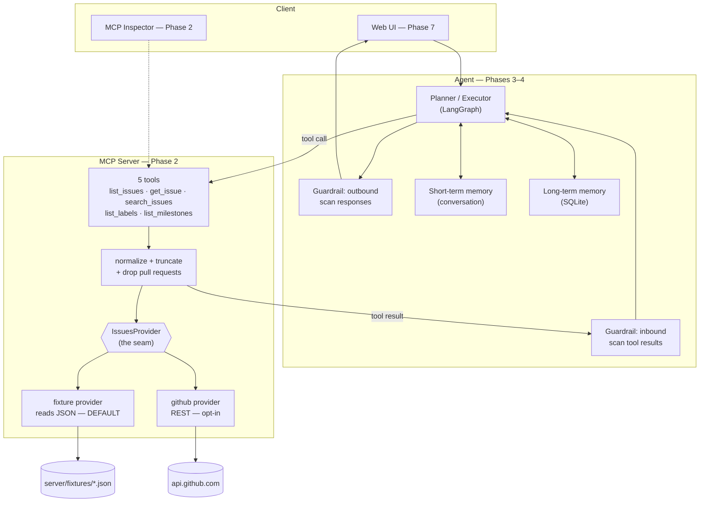

# Architecture

## The whole system (target state, Phases 2–7)

## Why the provider seam exists

Everything above the seam is built and tested on a machine with no GitHub repo, no PAT and no
LLM keys. `ISSUES_BACKEND` picks the implementation; nothing else in the system knows which one
it got.

The seam is load-bearing in four places:

| Concern | Without the seam | With it |
|---|---|---|
| Building without credentials | blocked at Phase 2 | fixture backend, no accounts |
| Eval stability (Phase 5) | pass rate drifts as the live repo changes | fixed corpus, fixed `FIXTURE_NOW` |
| Adversarial payloads | live in a repo anyone can edit | committed to version control |
| CI | needs a secret to run tests | offline unit suite, no secrets |

The cost is one invariant that must hold: **both providers return identical model types with
identical field semantics.** Phase 2 tests it explicitly. If it breaks, every component built
against fixtures diverges silently on live data — which is the exact failure the seam is
supposed to prevent.

## Trust boundary

The important architectural line is not the network edge — it's where *user-authored text*
enters the system. Issue bodies, comments, label descriptions and milestone descriptions are
written by arbitrary GitHub users. They are data to report on, never instructions to follow.

That boundary is marked in three places, on purpose:

1. **In the tool description.** `get_issue` states the trust rule inline, so the planner reads
   it as part of the tool contract.
2. **In `UNTRUSTED_FIELDS`** (exported from `server/__init__.py`) — a single machine-readable
   list of exactly which model fields carry untrusted text.
3. **In the inbound guardrail** (Phase 4c), which imports that constant rather than keeping its
   own list.

One list, three consumers. The alternative — each layer maintaining its own idea of what's
untrusted — is how a guardrail ends up scanning issue bodies but not comments.

## Design decisions worth defending in an interview

- **Structured errors over silent recovery.** A rate-limited tool call returns an error naming
  the reset time instead of sleeping. A planner can route around a stated failure; it cannot
  route around a 40-minute hang.
- **Pagination surfaced, never auto-followed.** One tool call that transparently fetches five
  pages is one tool call that can exhaust the context window. `has_more` makes it the planner's
  decision.
- **Summaries and detail are different tools.** `list_issues` never returns bodies. Cheap
  breadth-first scanning stays cheap; expensive full-text reads are explicit and per-issue.
- **The server admits what it did.** Exclusions, truncations and ranking approximations are
  reported in `notes`. Silent transformation is how an agent confidently misreports.
